# All about jenkins

Create Image 

```
docker build -t mandoor-jenkins-blueocean:2.33.2.3-1 . 

```

> blueocean popular jenkins plugin CI CD 


```
    docker network create jenkins
    # check network 
    > docker network ls 
```

create container jenkins 

``` 
docker run --name jenkins-blueocean --restart=on-failure --detach \
  --network jenkins --env DOCKER_HOST=tcp://docker:2376 \
  --env DOCKER_CERT_PATH=/certs/client --env DOCKER_TLS_VERIFY=1 \
  --publish 49000:8080 --publish 50000:50000 \
  --volume jenkins-data:/var/jenkins_home \
  --volume jenkins-docker-certs:/certs/client:ro \
  mandoor-jenkins-blueocean:2.33.2.3-1
```

1. call 127.0.0.1/49000

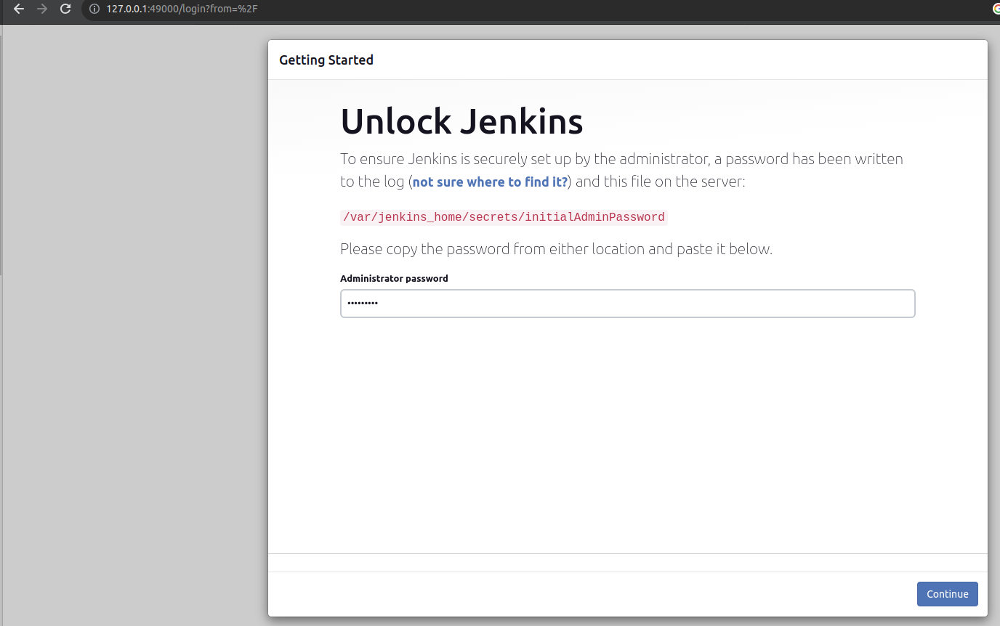

2. actualy jenkins already tell path passwor `/var/jenkins_home/secrets/initialAdminPassword`

```
    docker exec jenkins-blueocean cat /var/jenkins_home/secrets/initialAdminPassword
```

bbe8f48e84734d27a80f2ad5551b0c90

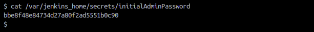

Choose Install

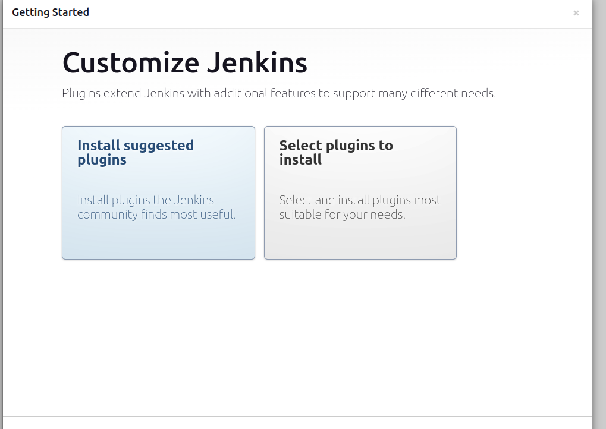

Instaling plugins 

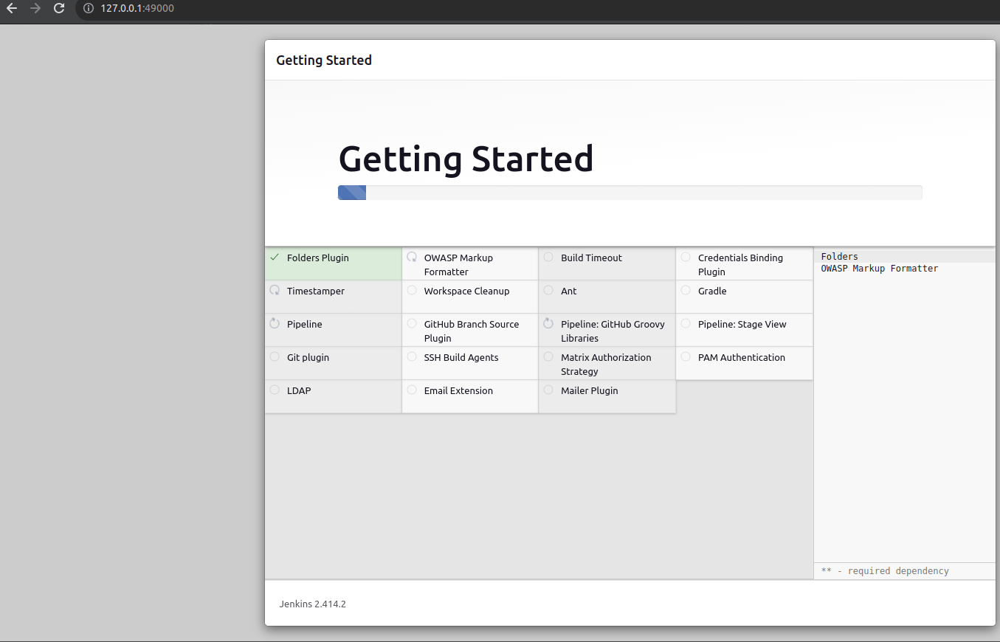


Create First Admin User

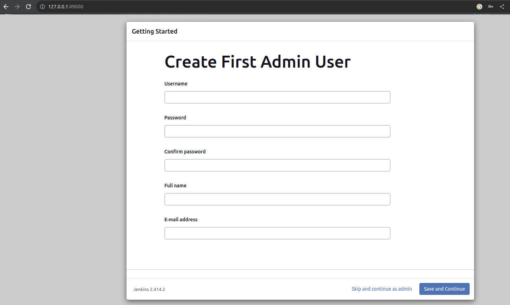


Instance Configuration

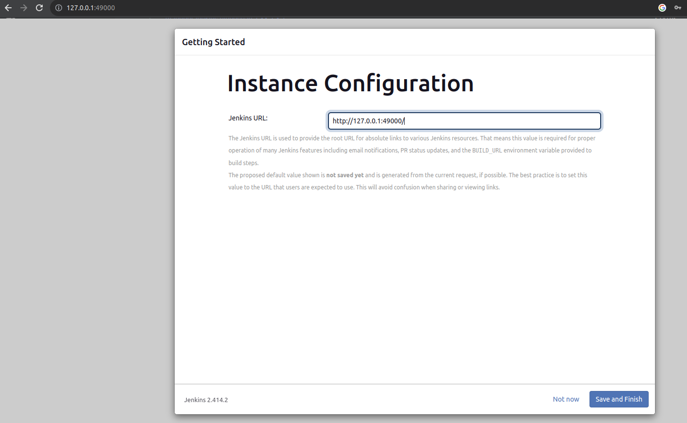

If Finished will show 

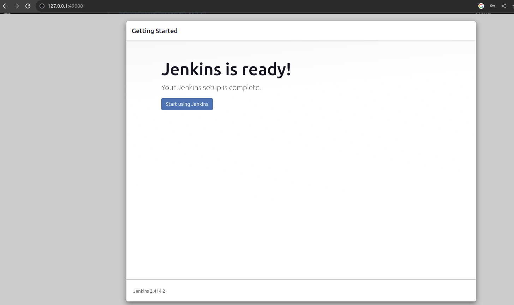

#Dashboard jenkins

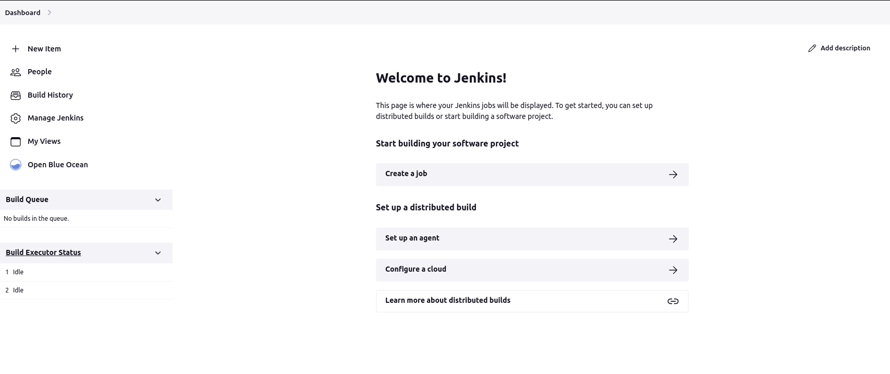

Menu: 
1. New Item : create your project and pipelines 
2. People:  Manage Administrate user Account
3. Build History: History All job have been run
4. Manage Jenkins: All your management stuff where your set up agent, where your install plugins
5. My Views: Organize your jobs  
6. Open Blue Ocean: Plugins for enhances your CI CD pipeline


# Manage Jenkins 

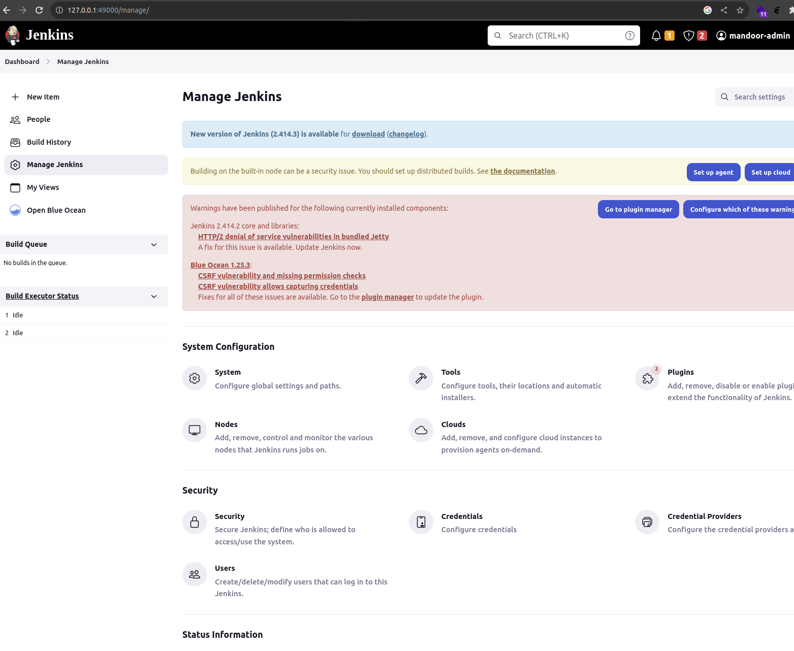

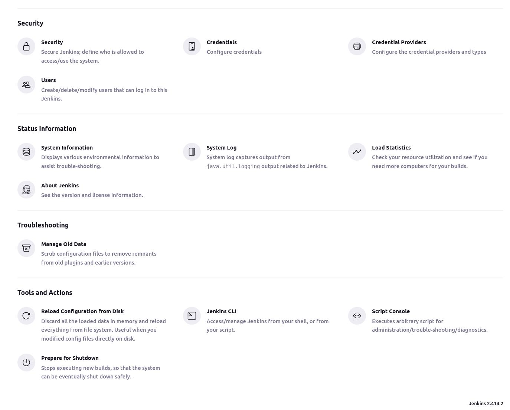

Menu: 

System Configuration 

1 Configure System: Give your information about jenkins server

    > let you set some global parameter

2 Manage Jenkins plugin:
   > install plugins each other stuff

3 Manage Node and Clouds: 
   > setup your agent as well as clouds, like kubernetes, docker, aws

   > anything about agent in here

Security

1. Configure Global Security: You can Setting global security
2. Manage Users: for manage users
3. Manage Credentials: 
    > You can manage ssh keys, api token, credential manager 


Status Information

1. System Information: system information about jenkins 
2. System Log: log 
3. Log Statistic

Tool and actions

1. Prepare for shutdown
    > you can set jenkins perform some short maintenance

    > you can set jenkins reboot server jenkins  

# Create First Project Jenkins 

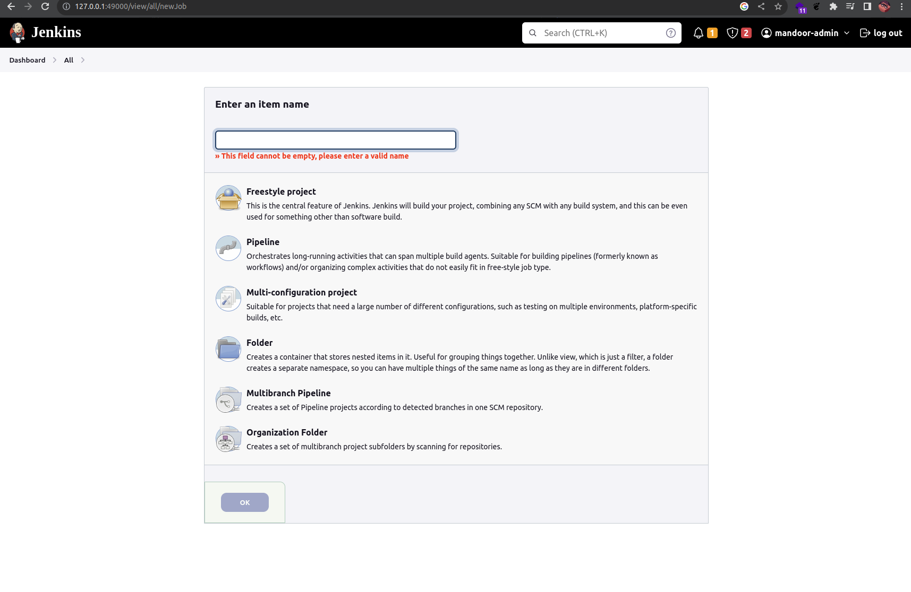

1. Choose Dashboard -> New Item 
2. Add Item name: first_job
3. Feestyle Project: 
   > Administration jenkins server, job doing any type consulting 

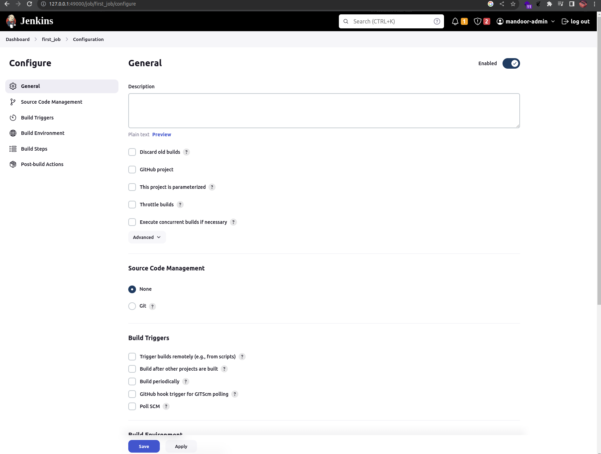

Source Code management

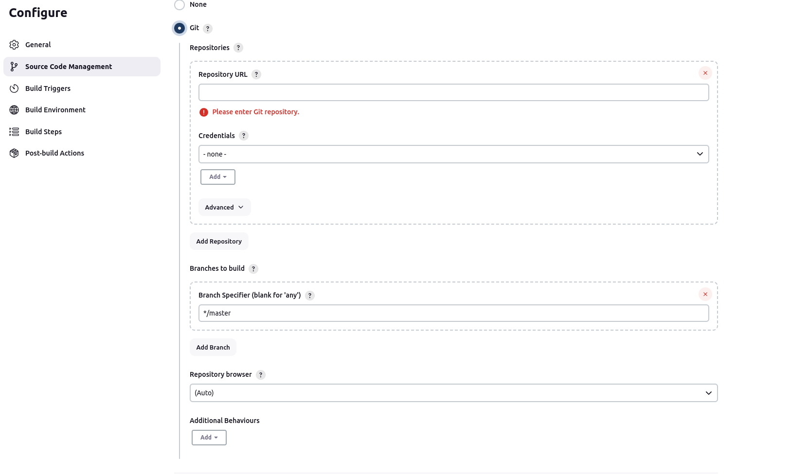

1.  Repository URL: you can put repository URL for get pull


Build Trigger
    
    > your buil trigger on your job

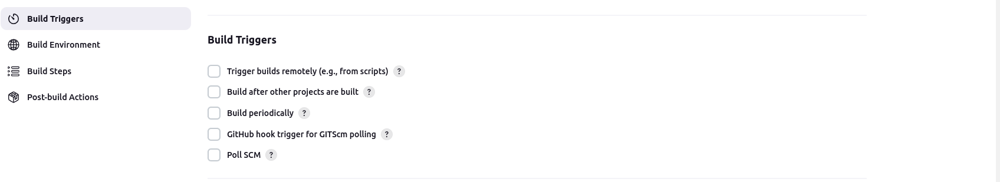

1. Github hook trigger for GITScm polling
   > a little more difficult if server jenkins using behind firewall
> Solution: either open port or use proxy service make sure web hook gets your jenkins server

2. Pool SCM: Jenkins Check Github periodically 
3. Build Periodically: setting like crob job set schedule, jekin will run base on schedule 


Build Environment: 

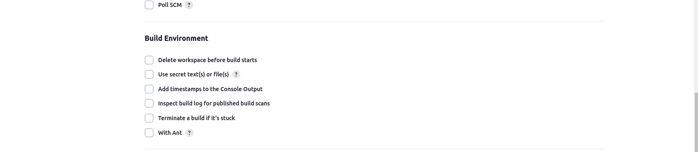


1. Delete workspace before build starts: if you want delete artifact 


Build 


> Build will going to go through 

Post Build Actions


> this just what happen when your build complete, like email notification


Start Create Job

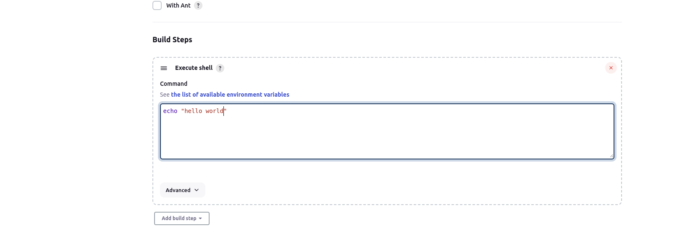

1. Choose section Build -> Execute shell
   > put example echo "hello world"
   
2. Choose Build now on left menu
3. And will show on build history 
4. and choose id pipeline
5. choose console out put 

> you can use list environment variable open : http://127.0.0.1:49000/env-vars.html/
 ```
    echo "hello world"
    echo "the build id jobs is ${BUILD_ID}"
    echo "the build  url is ${BUILD_URL}"
    
    ls -ltr

    echo "1234" test  > test.txt
  
    ls -ltr

```

> go to menu wokspace you can see test.txt 

> note if you want delete file latest build, go to configuration job and set/choose build  on section Build Environment Delete workspace before build starts

if you want see where file put on jenkins 

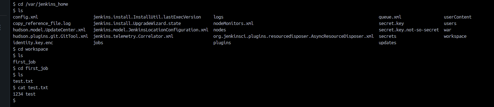

> /var/jenkins_home/workspace/<name job>


Install GOlang tools on jenkins

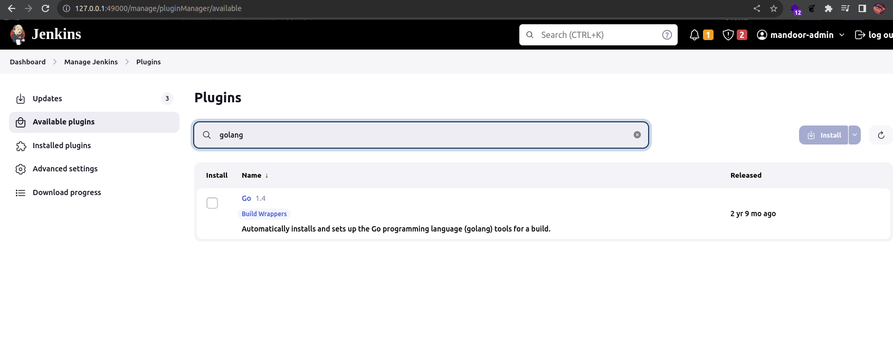

1. Manage jenkins -> plugins -> Available Plugins -> search "golang"


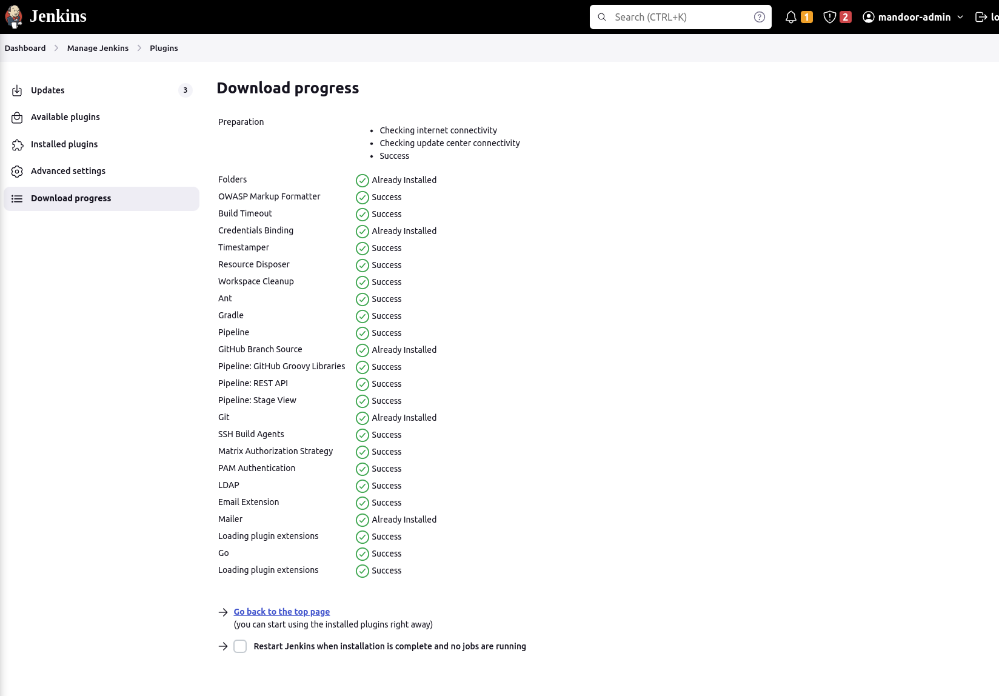

once install success choose restart 


Open Global Tool for golang 

1. go to menu manage jenkins -> Tools -> see Go installations
2. add go
   
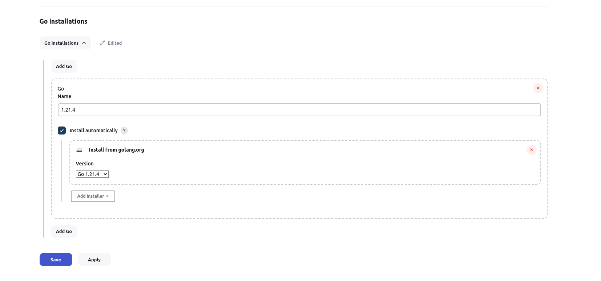


Test GO run version Using Pipeline

1. Menu New Items 
2. Choose Name + select Pipeline 
3. set script pipeline
```
pipeline {
    agent any 
    tools {
        go "1.21.4"
    }
    stages {
        stage("Example") {
            steps {
                sh 'go version'
            }
        }
    }
    
}
```
4. Choose Build Now


Test GO run freestyle

1. Menu New Items
2. Choose Name + select freestyle
3. set git repository 
4. set branch 
5. set Set up Go programming language tools (checked)
6. execute shell 